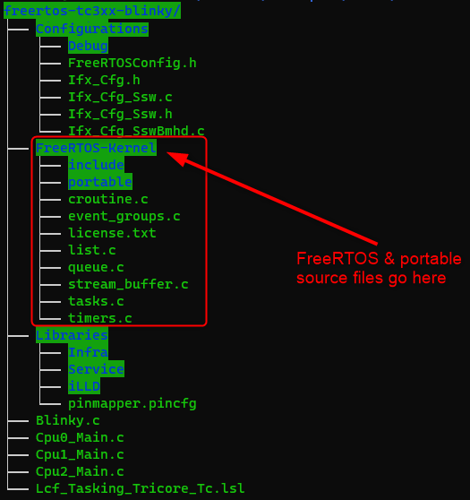

# FreeRTOS Port for Infineon AURIX™ TC3xx Devices

## Getting Started with FreeRTOS on AURIX TC3xx
All the currently available examples/demos are based on the [AURIX™ Development Studio (ADS)](https://www.infineon.com/cms/en/product/promopages/aurix-development-studio/), which includes a free TASKING compiler and debugger. The examples are built for the entry level [AURIX™ TC375 LiteKit](https://www.infineon.com/cms/en/product/evaluation-boards/kit_a2g_tc375_lite/) but should run on any TC3xx device/hardware with minor changes. All demos use the [Infineon Low Level Drivers (iLLDs)](https://www.infineon.com/cms/en/tools/aurix-embedded-sw/aurix-illd-drivers/), but a separate download is not required since they are included in ___AURIX™ Development Studio___

There are two demos available in this folder:
### iLLD_TC375_ADS_Blinky
A simple blinky code example which blinks an LED cyclically in a FreeRTOS task.
- ___FreeRTOSConfig.h___ is located under the ___Configurations/___ folder
- The `main(...)` entry point for the program is in ___Cpu0_Main.c___
- The source of the task which blinks the LED can be found in ___Blinky.c___

### iLLD_TC375_ADS_Timer_Interrupt
Creates one task which blinks `LED1` cyclically and polls `BUTTON1` and toggles the state of `LED2` whenever it is pressed. A second task blocks on `ulTaskNotifyTake(...)` and is notified from a Timer (GPT12) interrupt and then prints a message to the serial port using `printf(...)`
- ___FreeRTOSConfig.h___ is located under the ___Configurations/___ folder
- The `main(...)` entry point for the program is in ___Cpu0_Main.c___
- The source of the task which polls `BUTTON1` and controls `LED1` and `LED2`, can be found in ___Blinky.c___
- The GPT12 timer setup, the corresponding ISR and the task which prints a message to the serial port after each timer interrupt, can be found in ___Timer_Gpt12.c___

The directory structure should look, for example, something like this:  
  

The AURIX™ TC3xx port used for these demos is available in the ___Tasking/AURIX_TC3xx___ folder in the ___Partner Supported Ports___ repository.

## Pre-requisites
- Download and install the latest version of ___AURIX™ Development Studio___ [from here](https://softwaretools.infineon.com/tools/com.ifx.tb.tool.aurixide) or install it using the [Infineon Developer Center Launcher](https://www.infineon.com/cms/en/design-support/tools/utilities/infineon-developer-center-idc-launcher/?redirId=102702)
- The demos were developed for the ___AURIX™ TC375 Lite Kit___, which comes with an onboard miniWiggler USB debug interface and also contains a built-in serial interface (this is the serial port used by default for the ___iLLD_TC375_ADS_Timer_Interrupt___ demo). More details about the ___AURIX™ TC375 Lite Kit___ can be found [here](https://www.infineon.com/cms/en/product/evaluation-boards/kit_a2g_tc375_lite/)
    - The demos, however, can be ported to any TC3xx board with minimal changes
    - The port pins used for LEDs and the BUTTON are defined using macros at the top of the files which uses them, e.g.
    ```C
    #define LED_1       IfxPort_P00_5       /* Port/Pin for LED 1     */
    #define LED_2       IfxPort_P00_6       /* Port/Pin for LED 2     */
    #define BUTTON_1    IfxPort_P00_7       /* Port/Pin for BUTTION 1 */
    ```
  
    - The serial port (ASCLINx) module, port pins and baudrate configuration can be found at the top of ___Cpu0_Main.c___#, i.e.
    ```C
    /* ASCLIN0 module and UART TX/RX pin selection */
    SERIALIO_t SERIALIO =
    {
        .asclin = &MODULE_ASCLIN0,
        .tx_pin = &IfxAsclin0_TX_P14_0_OUT,
        .rx_pin = &IfxAsclin0_RXA_P14_1_IN
    };
    ```

A TC375 FreeRTOS example that works out-of-the-box is also available in the ___Infineon Code Examples Repository___, which can be accessed using the ___Import___ menu inside __AURIX™ Development Studio__.


## Run and Test
- Each demo folder is a complete ADS project. Populate the FreeRTOS-Kernel folder as shown in the directory structure screenshot above and import the project using ___File > Import > Existing Projects into Workspace___ and then browse to the location of the project, i.e.  

  
  

- Compile the code using the _**Build Active Project**_ button () in the toolbar or by right-clicking the project name and selecting _**Build Project**_ (if it is not already the active project, right click on the respective demo project and click ___Set Active Project___)
- Connect the lite kit to the PC using a micro-USB cable
- Click the **Debug Active Project** button () to flash and debug the project

Once the debugger opens, the code will stop at a default startup breakpoint, click  or press F8 to continue.

## References  

AURIX™ Development Studio is available online:  
- <https://www.infineon.com/aurixdevelopmentstudio>  
- Use the "Import..." function to get access to more code examples  

AURIX™ TC3xx User Manual:
- Part 1: <https://www.infineon.com/dgdl/Infineon-AURIX_TC3xx_Part1-UserManual-v02_00-EN.pdf?fileId=5546d462712ef9b701717d3605221d96>
- Part 2: <https://www.infineon.com/dgdl/Infineon-AURIX_TC3xx_Part2-UserManual-v02_00-EN.pdf?fileId=5546d462712ef9b701717d35f8541d94>

ERU_Interrupt_1 for KIT_AURIX_TC375_LK code example:
- <https://www.infineon.com/dgdl/Infineon-ERU_Interrupt_1_KIT_TC375_LK-Training-v01_00-EN.pdf?fileId=5546d4627883d7e00178a2b1b5053878>

FreeRTOS Quick Start Guide:
- <https://www.freertos.org/FreeRTOS-quick-start-guide.html>

More code examples can be found on the GIT repository:  
- <https://github.com/Infineon/AURIX_code_examples>  

For additional trainings, visit our webpage:  
- <https://www.infineon.com/aurix-expert-training>  

For questions and support, use the AURIX™ Forum:  
- <https://community.infineon.com/t5/AURIX/bd-p/AURIX>  
