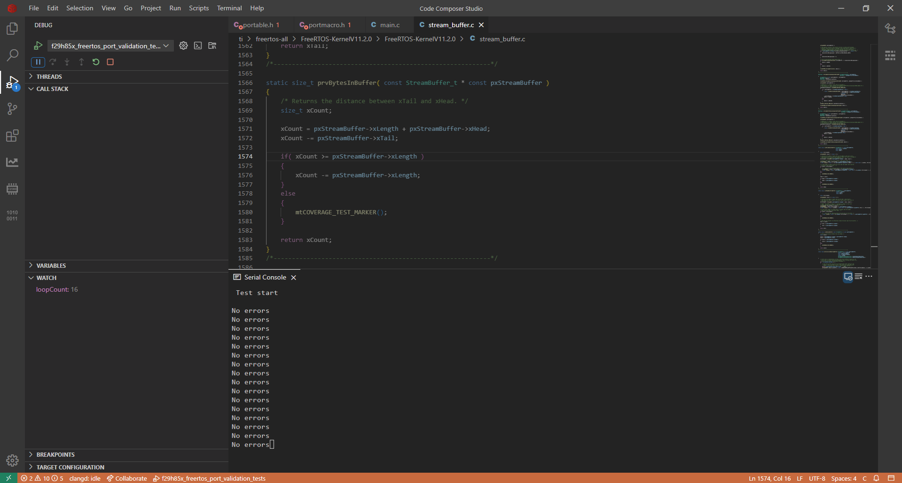

# Overview

This directory contains FreeRTOS demo projects for the Texas Instruments F29H85x series of Real-Time MCUs, equipped with three C29x 64-bit CPUs running at 200MHz. These projects are designed to be run with Code Composer Studio v20x IDE.

## Software & Tool Dependencies

- [FreeRTOS Kernel](https://github.com/FreeRTOS/FreeRTOS-Kernel/releases/tag/V11.2.0) **v11.2.0**
- [FreeRTOS Full Release](https://github.com/FreeRTOS/FreeRTOS/releases/tag/202411.00) **v202411.00**
- [Code Composer Studio IDE](https://www.ti.com/tool/download/CCSTUDIO) **v20x** : Include C2000 real-time microcontroller device support during installation
- [F29H85X-SDK](https://www.ti.com/tool/download/F29H85X-SDK/1.01.00.00) **v1.01.00.00** (or above)
- [C29-CGT](https://www.ti.com/tool/download/C29-CGT/1.0.0.LTS) **v1.0.0LTS** : Included with CCS v20x

## Included Demos

### 1. Port Validation Tests

This project runs the set of standard FreeRTOS tests as described [here](https://github.com/FreeRTOS/FreeRTOS/blob/main/FreeRTOS/Demo/ThirdParty/Template/README.md). Individual tests to be run are configured in *`FreeRTOSConfig.h`*.

### How to Run

- Open *`ccs/freertos_port_validation_tests.projectspec`*, and fill in the following path variables:
    1. **PATH_F29H85X_SDK** : Path to the F29H85X-SDK installation
    2. **PATH_FREERTOS_KERNEL** : Path to FreeRTOS Kernel v11.2.0 installation
    3. **PATH_FREERTOS_FULL** : Path to the FreeRTOS Full Release v202411.00
  
  This port has been validated with FreeRTOS Kernel v11.2.0, and the Common Demo files from FreeRTOS Full Release v202411.00. Ensure exact versions are used for both of these.

- Import the **f29h85x_freertos_port_validation_tests** project into CCS
- Navigate to *Project Properties > C2000 Compiler > C2000 Compiler Flags*, and delete the path `-I"${COM_TI_F29H85X_SDK_INCLUDE_PATH}"` from the Include list. This is to ensure that the FreeRTOS copy included in the F29H85X-SDK does not conflict with the external installations being used.
- Build and debug the project
- Connect to the XDS110 UART COM port with following settings:
    - Bits per second = 9600
    - Data Bits = 8
    - Parity = None
    - Stop Bits = 1
    - Hardware Control = None

### Watch Variables

- pcStatusMessage is logged on the COM port once every ~5 seconds
- loopCount - Number of iterations of Check task completed.

### Output

If all enabled tests pass, "No errors" can be seen on the UART output

## Support

- Additional examples, tools and documentation are available in the F29H85X-SDK. Refer to the [SDK documentation](https://software-dl.ti.com/C2000/docs/f29h85x-sdk/latest/docs/html/index.html) for further details  
- For further support/queries, please raise a query on the Texas Instruments [E2E Support Forum](https://e2e.ti.com/)  
