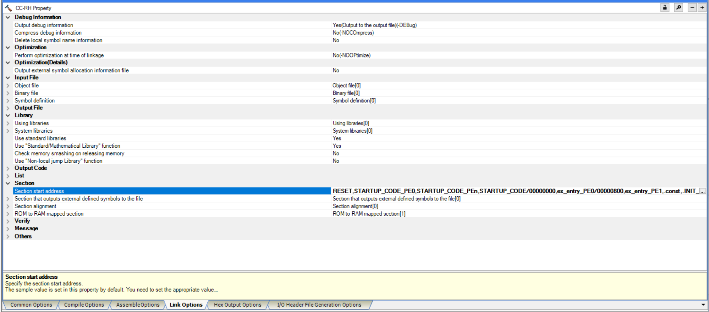

# RH850 U2Ax FreeRTOS Partner Supported Demo with CC-RH Compiler

## Introduction
This directory contains demo project for Renesas RH850 U2A8 using the CC-RH compiler.<br />
This example implements the standard test demos detailed in following link: [RTOS Third Party Demo](https://github.com/FreeRTOS/FreeRTOS/blob/main/FreeRTOS/Demo/ThirdParty/Template/README.md).

## IDE
- [CS+ support RH850 family](https://www.renesas.com/en/software-tool/cs?srsltid=AfmBOoqK5LDXK_CY45rHXBlWg4XojnYUopLwSC9DjUXsDYs4pa0oTZke#downloads).<br />
  More guidelines for building and running the CC-RH compiler can be found in the [C Compiler Package for RH850 Family](https://www.renesas.com/en/software-tool/c-compiler-package-rh850-family-cc-rh).

## How to build and run the Demo Project
   1. Open CS+ (File *.mtpj) and import this project **File->Open**.<br />
      Select test case you want to run by changing definition `configSTART_<Test_Name>_TESTS` in `freertos_cfg\FreeRTOSConfig.h` macros to `0` or ` 1` as needed.<br />

      Monitoring results via Tera Term (Using UART Interface).<br />
      Please download Tera Term from the following link [Tera Term Official Website](https://teratermproject.github.io/index-en.html).<br />

      1.1. Configure Tera Term transmit options.<br />
      

      1.2. Set up the Tera Term connection.<br />
      Choose the appropriate COM port.<br />
      

      1.3. View results in Tera Term terminal.<br />
      The output from the device will be displayed in the terminal window.<br />
      

      The UART configuration:<br />
    - The UART TX pin of U2x device: P02_6 (with U2Bx) / P10_0 (with U2Ax) connects to the UART RX pin of USB UART<br />
    - Baudrate: 115200<br />
    - Data bit: 8<br />
    - Stop bit: 1<br />
    - Parity: None

## Linker Script
Add below linker script to your linker section.
```c
RESET,STARTUP_CODE_PE0,STARTUP_CODE_PEn,STARTUP_CODE/00000000,ex_entry_PE0/00001000,ex_entry_PE1/00001400,.const,.INIT_BSEC.const,.INIT_DSEC.const,.data,.text/00004000,.inttable_PE0.const/00040000,.inttable_PE1.const/00041000,.stack_pe1.bss/FDA00000,.stack.bss/FDC00000,.data.R,.bss,.mev_address.bss/FE000000
```



## Note
   1. The configuration `configRUN_MULTIPLE_PRIORITIES` must be set to `0` to PASS the following test cases:<br />
    - `configSTART_GENERIC_QUEUE_TESTS` = `1`<br />
    - `configSTART_PEEK_QUEUE_TESTS` = `1`<br />
    - `configSTART_RECURSIVE_MUTEX_TESTS` = `1`<br />
    - `configSTART_EVENT_GROUP_TESTS` = `1`<br />
    - `configSTART_INTERRUPT_SEMAPHORE_TESTS` = `1`<br />
    - `configSTART_BLOCK_TIME_TESTS` = `1`<br />
    - `configSTART_TIMER_TESTS` = `1`

   2. For more information on setting up the vector table and configuring the interrupt vector method, disabling the FPU/FXU Units when not in use, and configuring interrupts, please refer to the [README.md](https://github.com/FreeRTOS/FreeRTOS-Kernel-Partner-Supported-Ports/blob/main/CCRH/U2x/README.md) file included with the Port files.<br />
      It provides helpful background information on system initialization and hardware-specific settings.
